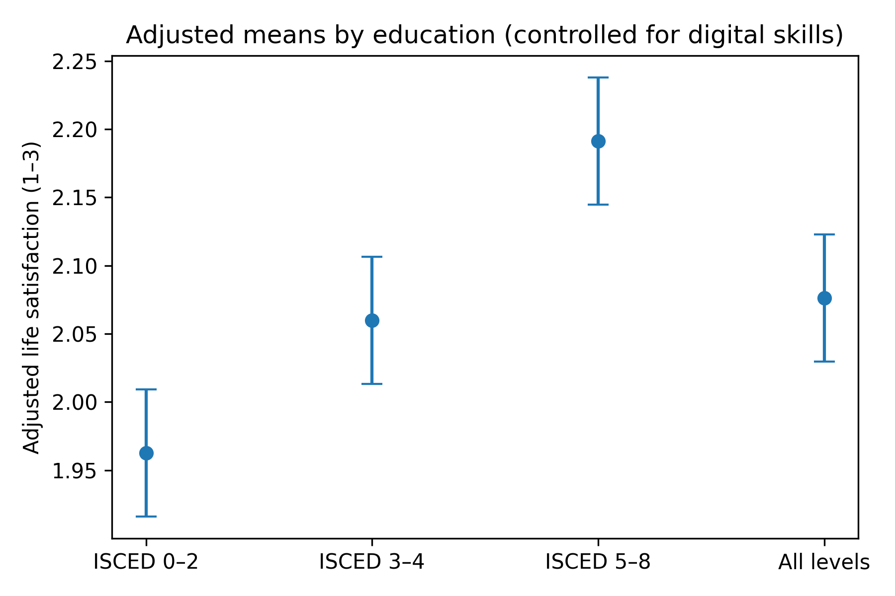
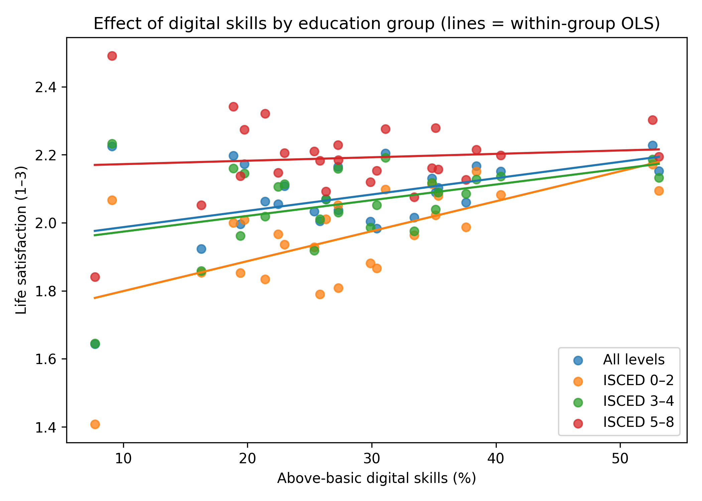

# Education, Digital Skills, and Life Satisfaction in Europe (ANCOVA Study, 2023)
This mini-project investigates how educational attainment (Bourdieu’s cultural capital) and digital competence (van Dijk’s digital divide framework) jointly relate to life satisfaction across European countries (EU-SILC & DESI 2023).
An Analysis of Covariance (ANCOVA) was used to test whether differences in life satisfaction between education levels remain significant after controlling for national digital skills.

# Theoretical Background

Bourdieu (1986) — Cultural capital in the form of education shapes access to symbolic and material resources, influencing subjective well-being.

van Dijk (2007) — Digital divide theory extends capital logic to digital participation: access, skills, and outcomes produce new social inequalities. Digital capital therefore represents an additional dimension of stratification within Bourdieu’s framework.

Wallerstein (1974) — World-systems theory provides the macro-structural lens: countries differ in their integration into the “core–periphery” digital economy.
Future extensions of this analysis will test this spatial hypothesis using NUTS2 regional data.

# Research Questions & Hypotheses

| Research question                                                         | Null hypothesis (H₀)                                 | Alternative hypothesis (H₁)                                                 |
| ------------------------------------------------------------------------- | ---------------------------------------------------- | --------------------------------------------------------------------------- |
| RQ1. Are there differences in life satisfaction between education levels? | No mean differences across ISCED groups.             | Higher education predicts greater life satisfaction.                        |
| RQ2. Is national digital competence related to life satisfaction?         | No association.                                      | Higher *above-basic digital skills* correspond to higher life satisfaction (positive association). |
| RQ3. Does education moderate this relationship?                           | No interaction between education and digital skills. | The positive association between digital skills and life satisfaction is stronger for higher ISCED levels. |

# Methodology & Statistical Approach
Design. Cross-sectional, ecological analysis using 2023 aggregates by country × education level.
Units. EU/EEA countries where both EU-SILC and DESI were available in 2023.
| Variable                     | Source                    | Type                         | Description                                                    |
| ---------------------------- | ------------------------- | ---------------------------- | -------------------------------------------------------------- |
| `life_satisfaction`          | EU-SILC 2023              | Dependent variable           | Weighted index 1 = Low, 2 = Medium, 3 = High life satisfaction |
| `edu_group`                  | EU-SILC 2023              | Factor (IV)                  | Education levels (ISCED 0–2, 3–4, 5–8)                         |
| `above_basic_digital_skills` | DESI 2023                 | Covariate                    | % of population with advanced digital skills                   |


## ANCOVA

An ANCOVA was conducted to test whether educational differences in life satisfaction persist after adjusting for national levels of digital competence.

The model specification was:

LifeSatisfaction = Education + DigitalSkills + (Education * DigitalSkills)

After verifying assumptions, the interaction term was not significant (p = 0.09), indicating homogeneous regression slopes across education levels. Therefore, the final model excluded the interaction.

---

## Model checks

| Assumption | Test | Result | Interpretation |
|-------------|------|---------|----------------|
| Homogeneity of variance | Levene’s Test | p = 0.657 | ✔ Satisfied |
| Normality of residuals | Shapiro–Wilk | p = 0.0004 | ⚠ Some deviation (robust at n≈100) |
| Homogeneity of regression slopes | Interaction term | p = 0.09 | ✔ Satisfied |
| Independence | Design-based | - | ✔ Independent units (countries) |

---

## Figures

**Figure 1.** Adjusted mean life satisfaction by education (controlled for digital skills)  


**Figure 2.** Relationship between digital competence and life satisfaction by education group (parallel slopes ≈ no interaction)  


---

# Results

| Effect | F | p | partial η² | Interpretation |
|---------|---|---|-------------|----------------|
| **Education (ISCED)** | 15.90 | < 0.001 | 0.325 | Large effect – education strongly predicts life satisfaction |
| **Above-basic digital skills** | 19.52 | < 0.001 | 0.165 | Medium–large effect – digital competence positively associated |
| **Model R²** | — | — | **0.44** | 44% of variance in life satisfaction explained |

The results indicate that both education and digital competence are significant, independent predictors of subjective well-being. The absence of a significant interaction suggests that the positive association between digital skills and life satisfaction is consistent across education levels.

---

# Discussion

H₁ (RQ1: Education differences) — Supported.
After controlling for national digital competence, mean life satisfaction still differed significantly across ISCED levels (F(3, 99) = 15.90, p < .001; partial η² = .325, large). This aligns with Bourdieu’s view that higher education (cultural capital) confers durable advantages reflected in higher subjective well-being.

H₁₂ (RQ2: Digital skills association) — Supported (directional).
The share of citizens with above-basic digital skills was positively associated with life satisfaction (F(1, 99) = 19.52, p < .001; partial η² = .165, medium–large). In van Dijk’s terms, digital competence functions as digital capital, enabling better access, participation, and outcomes in a digitized society.

H₁₃ (RQ3: Moderation by education) — Not supported.
The interaction was not significant (p = .09). Substantively, the slope of digital skills → life satisfaction is similar across ISCED levels. Thus, digital capital appears complementary rather than contingent on education: more digital competence benefits all education groups to a comparable degree.

---

## Limitations and Methodological Notes
**Analytical level:** The analysis is ecological (country × education aggregates). Results describe structural relationships, not individual causation.  
**Measurement:** Life satisfaction is a pseudo-interval variable (1–3), derived from categorical survey data.  
**Model:** Only the *above-basic* DESI indicator was used; other digital subindices (connectivity, human capital) were not included.  
**Distributional assumptions:** Normality slightly violated; ANCOVA robust at n≈100.  
**Cross-sectional design:** 2023 only; cannot capture temporal change or causality.  
**Omitted variables:** Income, employment, health, and institutional trust may confound observed relationships.

These caveats are explicitly acknowledged to maintain methodological transparency.

---
# Conclusion
## EU Policy Implications

The findings highlight how strengthening both **educational systems** and **digital skills programmes** can yield complementary gains in subjective well-being.  
They align with the **EU Digital Decade** strategy, which emphasises reducing *second-level* digital divides (skills and outcomes), and support viewing digital competence as a key dimension of social inclusion.

---

## Future Directions

- Expand the analysis to **regional (NUTS2)** levels to test **Wallerstein’s core–periphery** dynamics within Europe.  
- Integrate **Luhmann’s systems theory** or **Actor–Network Theory (ANT)** to conceptualise technology as an active agent in social differentiation.  
- Extend the model with economic (GDP), institutional (trust), and psychological (health, autonomy) variables for a multidimensional perspective on well-being.

---

## 🔄 How to Reproduce (Step-by-Step for Beginners)

1. **Install requirements** (you can do this in Google Colab or locally):

   ```bash
   pip install -r requirements.txt

---
   
# Citation
Data: Eurostat (EU-SILC 2023; DESI 2023)  
Author & AI Assistance: This analysis and report were authored by Zvonimir Škrinjarić. Drafting, code refactoring, and statistical coaching were supported by an AI assistant (ChatGPT, “GPT-5 Thinking”) for tasks such as: code scaffolding (pandas/statsmodels), assumption checks, effect size computation, and editorial polishing. All data handling, model choices, interpretation, and final decisions were reviewed and validated by the author.


